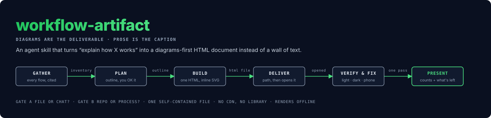
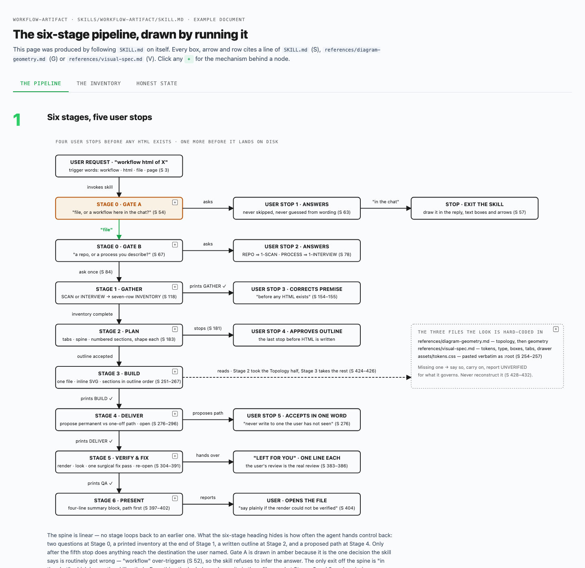
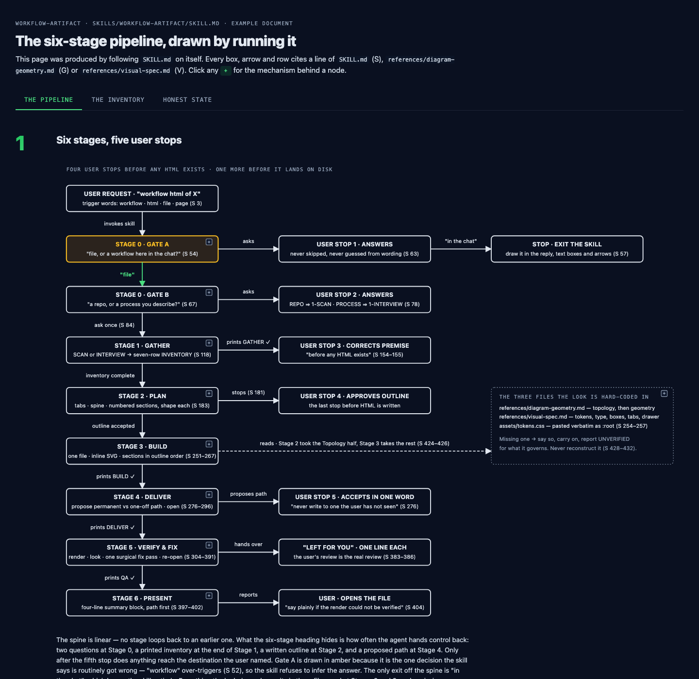
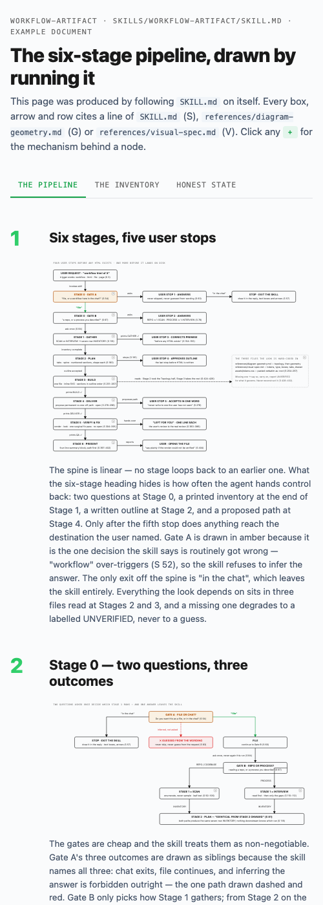
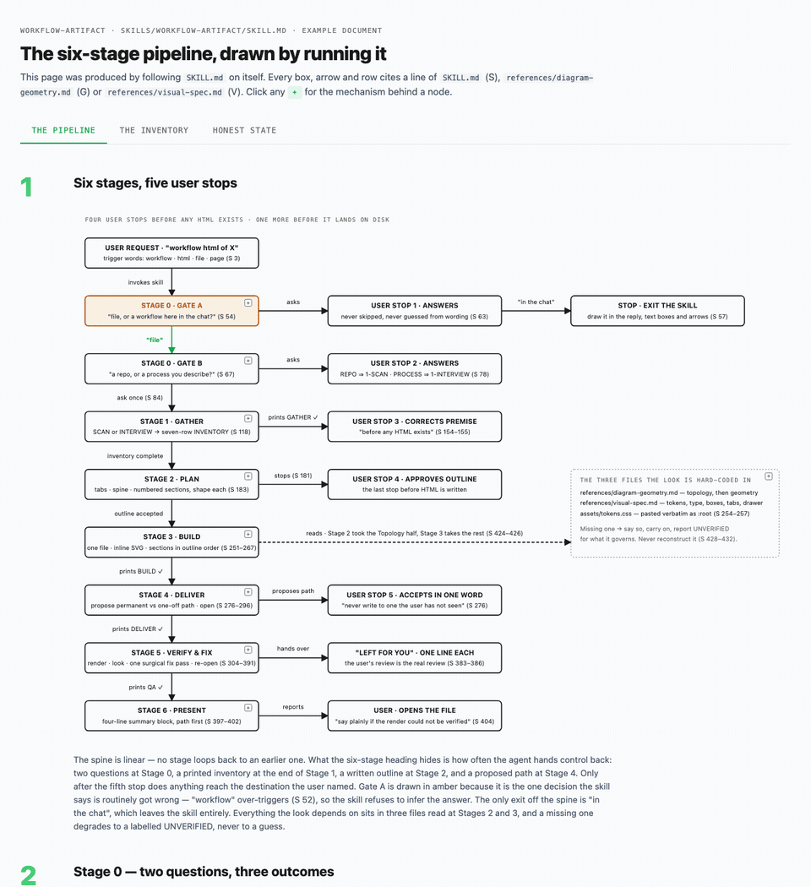

# workflow-artifact

An agent skill that turns "explain how X works" into a diagrams-first HTML
document instead of a wall of text.

**[Live preview →](https://djfunboy.github.io/workflow-artifact-skill/examples/workflow-artifact-pipeline.html)**
a document the skill produced about itself. Click a tab, click a `+`.

Give it a codebase or describe a process. It enumerates every flow, trigger,
dependency, branch and failure path, cites each one, then builds a single
self-contained HTML page: hand-authored SVG diagrams, tables with a "so what"
column, click-to-expand detail, tabs for large subjects. It renders the page headless
where it can, fixes what it sees, and says "UNVERIFIED" when it could not
render rather than guessing.



Works in Claude Code and any agent that reads the
[Agent Skills](https://github.com/vercel-labs/skills) layout
(`skills/<name>/SKILL.md`).

## Install

```bash
npx skills add djfunboy/workflow-artifact-skill
```

Or copy the folder by hand. For Claude Code:

```bash
git clone https://github.com/djfunboy/workflow-artifact-skill
cp -R workflow-artifact/skills/workflow-artifact ~/.claude/skills/
```

Any other agent: point it at `skills/workflow-artifact/SKILL.md` and tell it
to follow the procedure.

## Use

Ask for a workflow, process flow, architecture doc, system map or explainer
as a file, page or HTML:

```
map how auth works in this repo as an HTML page
give me a workflow html of the release process
document how the config loads, as a file I can open
```

The skill asks two questions before it does anything, then runs six stages.

```
   ┌──────────────┐  file   ┌──────────────┐  repo ──► SCAN
   │ Gate A       │───────► │ Gate B       │
   │ file or chat?│         │ repo or      │  process ─► INTERVIEW
   └──────┬───────┘         │ process?     │
          │ chat            └──────────────┘
          ▼
     exits — draws it in the reply instead

   ┌────────┐   ┌────────┐   ┌────────┐   ┌─────────┐   ┌──────────────┐   ┌─────────┐
   │ GATHER │──►│  PLAN  │──►│ BUILD  │──►│ DELIVER │──►│ VERIFY & FIX │──►│ PRESENT │
   │ every  │   │ stops  │   │ one    │   │ propose │   │ render light │   │ summary │
   │ flow,  │   │ for    │   │ HTML   │   │ a path, │   │ dark mobile, │   │ + what  │
   │ cited  │   │ your   │   │ file   │   │ open it │   │ one fix pass │   │ is left │
   └────────┘   │ OK     │   └────────┘   └─────────┘   └──────────────┘   └─────────┘
                └────────┘
```

| Stage | What it produces | What it refuses to do |
|---|---|---|
| **GATHER** | an inventory: steps, triggers, dependencies, branches, failure paths, handoffs, state, every row cited to a file and line | sample one flow and call it representative; guess from a name |
| **PLAN** | a visible outline you approve before any HTML exists | pad a small subject to look big; force tabs to equal length |
| **BUILD** | one HTML file, inline SVG, no CDN, no library, renders offline | Mermaid, D3, a fonts link, a legend |
| **DELIVER** | a proposed path next to the subject's own docs, then opens the file | write somewhere you have not seen |
| **VERIFY & FIX** | screenshots in light, dark and at phone width; a console read; one surgical fix pass | call it done unrendered; loop on polish |
| **PRESENT** | a four-line summary with counts and what is left for you | imply a render it did not do |

## What the output looks like

Every document follows one hard-coded visual idiom, so two documents about
different systems look like they came from the same hand.

- **Solid arrows are flow. Dashed arrows are reference or a broken path.**
  `✗` marks where a flow is broken.
- **Every arrow is labelled.** `writes`, `polls 30s`, `invalidates`. An
  unlabelled arrow says "related somehow", which is nothing.
- **Real names only.** `Postgres · users`, not "Database".
- **Green is the page colour. Amber is diagram-only,** reserved for the one
  decision point under discussion. Red is the broken path.
- **Orthogonal lines only.** No curves, no diagonals. Text is sized by
  arithmetic (`chars × font-size × 0.50` for sans, `× 0.55` for mono), not by eye.
- **Callouts sit beside the flow, never inside it.**
- **At least one honest-state section per tab:** what works, what does not,
  and the evidence, with a `working` / `partly` / `not working` chip.

Light and dark both work, `prefers-reduced-motion` is respected, and the page
never scrolls sideways.

<p>
  
  
</p>



The source is [`examples/workflow-artifact-pipeline.html`](examples/workflow-artifact-pipeline.html),
one file, no dependencies. Open it from disk with the network off.

## Pro tip: the same rules for chat replies

This skill governs files. For the agent's chat replies, the same idiom works
as a per-prompt hook. This is the exact text one of us injects on every
prompt through a Claude Code `UserPromptSubmit` hook (any hook that prints
to stdout will do, or paste it into your `CLAUDE.md`):

```
[format] Answer in workflows, relationship maps, decision trees, and tables — never a wall of text. Solid arrows for flow, dotted for reference, ✗ where a flow is broken. Callout boxes beside the flow, not in it. Tables carry rationale and recommendation, not just facts.
Box every node. Boxes stay small, the diagram runs as wide and as long as it needs. Parallel things side by side, branches as side-by-side boxes, every arrow labelled.
```

Minimal hook, `~/.claude/settings.json`:

```json
{
  "hooks": {
    "UserPromptSubmit": [
      { "hooks": [ { "type": "command", "command": "cat ~/.claude/format-rule.txt" } ] }
    ]
  }
}
```

The rationale is deliberately not in the text. It fires on every prompt and
only needs the instruction; the "why" belongs in a file the agent reads once.

## Layout

```
skills/workflow-artifact/
├── SKILL.md                     the procedure
├── references/
│   ├── diagram-geometry.md      where nodes go, how lines route, how text fits — mechanical, checkable rules
│   └── visual-spec.md           colour, type, the SVG idiom, tabs, expander, drawer
└── assets/
    └── tokens.css               the design tokens, pasted verbatim into every document
```

## Why the rules are so specific

"Make it look clean" is not an instruction an agent can follow. "Estimated
text width 148px exceeds rect width 150px minus 30px padding" is. Every rule
in the references is written so that it can fail a specific check. That is
what makes the output consistent across runs, models and subjects.

## Contributing

Issues are welcome, especially a document the skill got wrong and why.
Pull requests may be declined; the idiom is deliberately fixed.

## Credits

The topology heuristics in `diagram-geometry.md` are adapted from
[konraddzbik/architecture-diagram-skill](https://github.com/konraddzbik/architecture-diagram-skill)
(MIT). The geometry rules are adapted from `svg-exemplar.md` and `design-qa.md` in
[rafaelolsr/archflow](https://github.com/rafaelolsr/archflow) (MIT per its
README; the repository has no LICENSE file). Notices are reproduced in
[THIRD_PARTY_NOTICES.md](THIRD_PARTY_NOTICES.md).

## Author

Chris Doyle — [@djfunboy](https://x.com/djfunboy)

Also by me: [Stash](https://yourstash.ai), a Mac screenshot, screen-recording
and clipboard tool built so AI agents can read your captures, not just look at
the pixels.

## License

MIT
